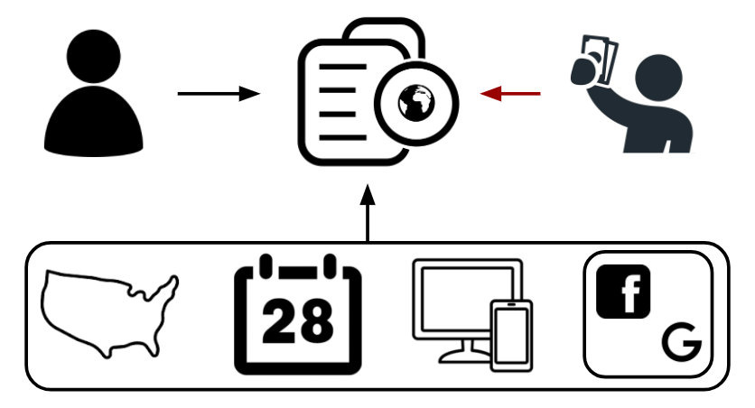
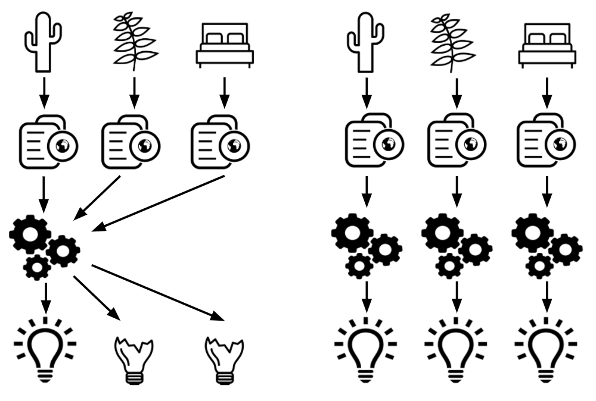
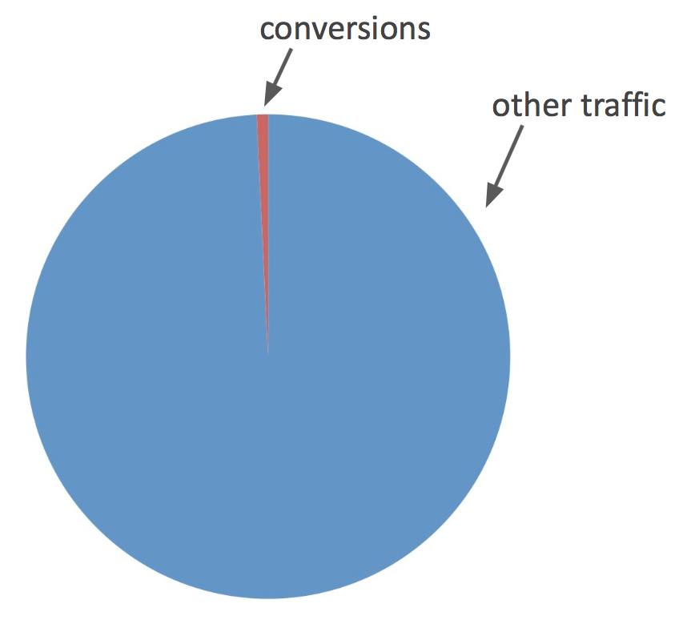
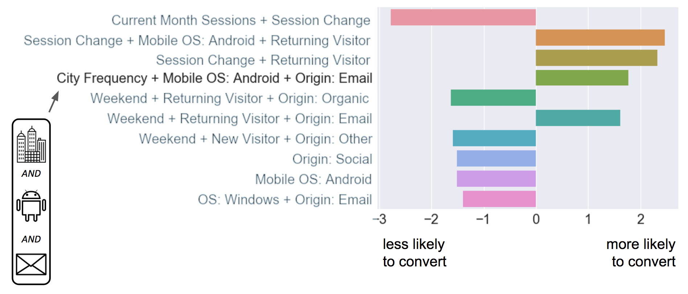

### Buy or Browse?: Identifying High-Value Traffic for Ecommerce
*A consulting project for PaveAI*
 
**Challenge:** My client, PaveAI, wants to deliver actionable insights from a customer classification model to Pave’s customers. The model must predict which traffic is likely to convert for end users. The model must also be applicable to any of Pave’s customers and fit within Pave’s existing data/analysis pipeline.
 
**Solution:** Model conversion probability for any customer. Use SMOTE and Tomek Link removal to account for heavy class imbalance, and engineer features from existing data to improve predictive power. 
 
**Result:** Created accurate model that augments Pave’s analytics product by pointing its clients to valuable leads. The increased value to end user will drive value to my client. 
 
**PaveAI makes money by providing actionable insights to its customers**
 
PaveAI is a B2B company that provides automated web analytics and insights to ecommerce customers in a wide variety of verticals, from baby gear to mattresses. Suppose one of Pave’s customers is an online cactus retailer called CactusCo. Pave ingests CactusCo’s Google Analytics data and produces automated monthly reports that include visualizations and policy recommendations. For example, the figure below features visualizations about the sources of CactusCo’s traffic and its transactions for that month that might be generated in a PaveAI report. In this case, an associated insight that Pave might include in the report could be “Traffic from Facebook jumped last month, but there was no associated increase in transactions - rethink the effectiveness of your Facebook campaign.”

 
**E-commerce companies want to determine which traffic is likely to convert**
 
CactusCo (and most ecommerce firms) want to be able to predict which customers are likely to actually buy something (this is called “converting”), and not just browse. If CactusCo can identify these high-value customers, they can perform more efficient ad targeting, or inform site design to account for the behavior of likely buyers. Pave’s challenge was to develop a classification model that can utilize CactusCo’s Google Analytics data from Pave’s existing data pipeline to predict which groups of users are likely to convert. Pave wants a model that can be run every month without additional user input, and that works for all their clients. 

 
**Google Analytics User Data: a Labeled Dataset** 
 
My client’s data pipeline outputs modified monthly Google Analytics data for CactusCo and their other customers. Each row of the data corresponds to a user, with categorical features including location, date of visit, operating system (Mac desktop, Android mobile, etc.) and source medium (organic search, social media, etc.). The data also includes continuous variables and one-month lags for metrics such as session duration, number of sessions, and whether or not the customer converted. The conversion value will serve as the label for each observation: did the customer buy or not?
 
I obtained data for five firms in a variety of markets. Each firm’s dataset contains from 75k to 200k observations, of which 0.5% to 1% are associated with a conversion. This represents a substantial class imbalance problem, which I discuss below. In addition, there are a large number of locations in each company’s data. Encoding these values as they are given results in a feature space that is too large for meaningful analysis, so I deal with this problem via feature selection and feature engineering, which I detail below.

 
 
**Model Selection: Logistic Regression Gives Interpretable Results**
 
Which model is appropriate for this problem? The answer depends critically on the intended business use. First, what is the metric for a successful model? Because of the class imbalance, we will want to focus on precision and recall separately, as opposed to univariate accuracy measures. Using a simple accuracy measure can be misleading - a model that predicts “no one ever converts” will be accurate 99% of the time. Not a helpful result! Because conversion events are rare, we do not want to miss any. Therefore the modeling priority is to maximize recall. Once recall is maximized, our goal is to minimize false positives. 
 
Second, interpretability is critical for this application. A Random Forest classifier is able to deliver high recall and precision, but it does not deliver interpretable coefficients that can lead to detailed business insights. This is a property shared by many nonlinear models including Neural Networks. Logistic Regression classifiers can’t match Random Forests’ precision, but the coefficients are more directly interpretable. A Logistic Regression classifier with polynomial interaction terms is able to deliver high recall, which is our most important metric. Pave’s business case is more about interpretability than extreme precision, so Logistic Regression is the most appropriate model here.
 
**One Model for All or One for Each?**

Further, should we fit one model incorporating data from all of Pave’s clients? Or one model for each? One meta model might work for all of Pave’s customers if there are common predictors that work for ecommerce in general. Or perhaps there are clusters of ecommerce businesses that share common predictors and can benefit from pooling data. To explore the question, I looked at data from two of PaveAI’s clients that are in a roughly similar product space - think CactusCo and Fern Alley. Models that fit CactusCo performed poorly on Fern Alley, and similarly poorly on more “distant” firms such as a mattress company. While there may be richer relationships between companies that allow for cross-company predictive models, I focus in the immediate case on fitting one model for each firm. 

 
**SMOTE and Tomek Links Correct for Class Imbalance**
 
For most ecommerce companies, conversions are a small percentage of all traffic. It is common that less than 1% of all visits result in a conversion. This is a challenge for modeling, as uncorrected models will tend to “fit” the data by predicting no conversions. The out-of-the-box solution incorporated in many modeling packages involves giving more weight to the minority class (conversions) in order to force the model to account for the imbalance. Another group of solutions involves oversampling the minority class and/or undersampling the majority class to artificially create more observations that look like conversions. I tried both, and found that using a technique called SMOTE for oversampling the conversions and using Tomek Link removal for undersampling the non-conversions boosts the recall and precision of a Logistic Regression substantially vs. the standard solution.

 
SMOTE works by picking two data points from the minority class and synthesizing a “new” data point in between them.  This creates new data that looks like the real minority class so that the model can predict it more easily. Tomek Links are pairs of observations where the closest neighbor of a conversion is a nonconversion. Since they are close together, they tend to cancel each other out in the model. By removing the nonconvert from the pair, it allows the model to “read” the relatively rare conversion data point. Using these two techniques in tandem gives a significant increase in recall over benchmark correction methods.

**Use Domain Knowledge to Engineer Features**

Without adding any outside data to my client’s data pipeline, I was able to engineer some features which turned out to contribute to the model’s predictive power. Speaking to an Insight alumnus who had worked on a similar problem in industry, I learned that in his experience, city-level demographic data was highly predictive for ecommerce conversions. However, Pave’s existing data pipeline does not include this data. the data does include a city feature, but it is a categorical variable with up to 5000 or more values. Encoding these values into dummy variables would increase the feature space dramatically, and make interaction terms infeasible to calculate. Not wanting to completely disregard the city-level data, I create a new variable “city frequency” which replaces each city with its frequency in the monthly data.

I also consulted with a contact at a behavioral marketing firm who indicated that, heuristically, the best predictor of a conversion is increased frequency of sessions; if someone visits a site multiple times in one day, they are going to convert. I do not have session data at this fine granularity, but I do have “sessions this month” and “sessions last month”. I roughly approximate the increase in frequency of visits by subtracting last month sessions from this month sessions to create a “sessions velocity” feature. I construct a similar feature for “session duration”. In total, the engineered features add significantly to the model’s precision and recall.

**The Resulting Model is Accurate and Interpretable**
 
I fit a Logistic Regression model for each of 5 companies. For each company, I construct a set of 3rd-degree interaction terms for each feature. This results in around 2500 features per model, so I use lasso feature selection to reduce the feature space to only the most important combinations of features. I did a grid search over regularization parameters to find the optimal value, which results in about 75 to 125 features per company. 
 
 

The model outputs interpretable results. For example, the figure above shows the top 10 most predictive features for CactusCo. In the highlighted row, we see that a combination of people who 1) Are from cities with high frequency, 2) used an Android mobile device, and 3) originated from email have a higher than average probability of conversion. This is a remarkably specific result! CactusCo can reach out to this group of customers with targeted ad buys to increase conversions.
 

  
In all, the model enables my client to deliver highly specific, actionable insights to its customers. By providing an incremental benefit to Pave’s product, the model is a net win for both Pave and its customers.
 
 
 
 
 
 
 
 
 
 
 
 
 
 
 

